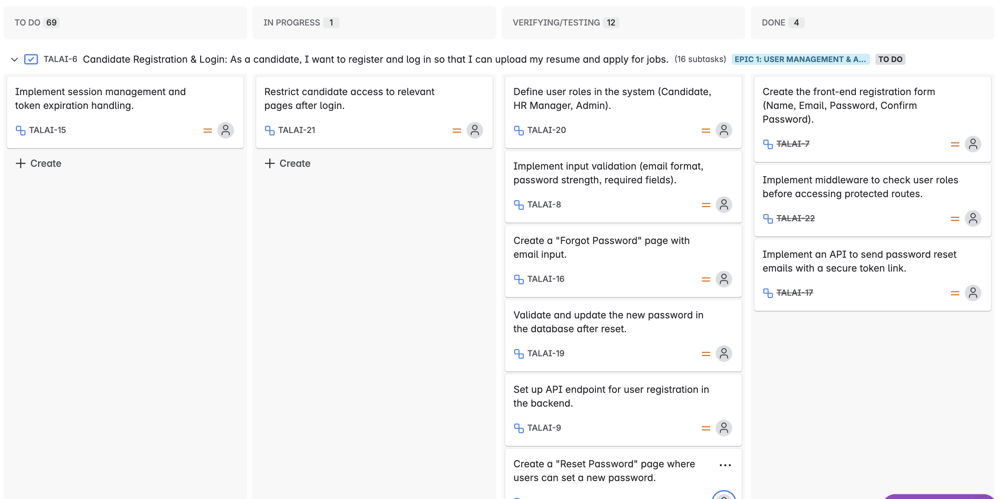
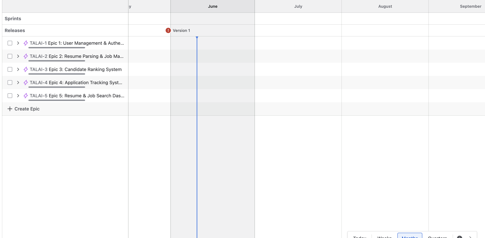

# AI Resume Project - Frontend
The AI Resume Application is a web-based project built using HTML, CSS and JavaScript. It provides an intuitive user interface to upload, view, and manage resumes according to skills, interest and strength. The application ensures a visually appealing and responsive layout, making it easy for users to interact with their resumes.

Our AI resume project is designed to meet the needs of two main target audiences: job seekers and employers.

For job seekers, the platform streamlines the process of finding relevant job opportunities. By uploading their resumes, job seekers receive personalized job matches tailored to their skills, experience, and preferences—reducing the time and effort needed to search for opportunities manually. This directly addresses their need for quick, accurate, and relevant job matching, increasing their chances of finding the right role faster.

For employers, the platform provides access to a pool of qualified candidates that match their job requirements. Using AI algorithms, the system analyzes candidate profiles and resumes to highlight the best fits for a given role. This saves employers time in the recruitment process and helps them find candidates whose skills align with their specific needs.

By focusing on these two target audiences, our platform bridges the gap between job seekers and employers—offering a smarter, data-driven approach to recruitment and job discovery.

In terms of security, we prioritize security to protect users’ sensitive information and ensure a trustworthy experience. Key security features include:

- HTTPS: Ensuring secure data transmission via SSL/TLS.

- Authentication/Authorization: Using secure login flows using Token based Authentication.

- Input Validation: Sanitizing user inputs to prevent injection.

- XSS Protection: Escaping dynamic content and applying CSP headers.

- CSRF Protection: Using anti-CSRF tokens for sensitive operations.

- Secure File Uploads: Limiting file types and size in Resume uploads.

- Dependency Updates: Keeping frontend libraries up to date.

- User Privacy: Clear data handling notices and compliance.


## Table of Contents
- [User stories](#user-stories)
- [Refined epics to User stories to tasks](#refined-epics)
- [Features](#features)
- [Wireframes](#wireframes)
- [Technologies Used](#technologies-used)
- [Setup Instructions](#setup-instructions)
- [Manual Testing](#manual-testing)
- [Validator Testing](#validator-testing)
- [Deployment Procedure](#deployment-procedure)


## User Stories
### Job Seeker User Stories
- As a job seeker, I want to upload my resume so that I can be matched with relevant job opportunities.

- As a job seeker, I want to see a list of jobs so that I can quickly find jobs or filter for jobs I can apply for.

- As a job seeker, I want to save jobs I’m interested in so that I can apply later.

- As a job seeker, I want my personal data to be protected and only shared with employers when I give consent.

### Employer User Stories
- As an employer, I want to post job openings so that I can attract qualified candidates and also edit jobs I have already posted.

- As an employer, I want to search for candidates based on their uploaded resumes and skills so that I can find the best match for my job roles.

- As an employer, I want to view matched candidates for a job opening so that I can quickly shortlist potential hires.

- As an employer, I want to view analytics and insights on the number of applications and matched candidates for my posted jobs.

- As an employer, I want to update the status of candidates who applied for a job.


## Refined Epics to User Stories to Tasks
In defining our epics, user stories and tasks, Jira was chosen for this task. Find below the evidence of refined epics to User Stories to Tasks using Jira where epics were refined to user stories and user stories were broken down into tasks to be completed.





## Features 
- Clean and modern UI for resume uploads
- Responsive design for all screen sizes
- Simple and lightweight interface
- Easy customization with CSS
- Clean and intuitive dashboards for Jobseekers and Employers

## Wireframes
This link routes you to the initial design (Wireframes) used for the development of the frontend: [UI Link](https://www.figma.com/design/0MprAOSLilpKR2YGMgiwKr/JOB-APP?node-id=0-1&p=f&t=7t4SQqRJaZIMDZr4-0)


## Technologies Used

- **HTML** – Structure and layout
- **CSS** – Styling and responsiveness
- **JavaScript** – For Dynamism of the website

## Setup Instructions

1. **Clone the Repository**:
   ```bash
   git clone https://github.com/peleisaac/ai-resume-frontend-v2.git
   ```

2. **Navigate to the project folder**
  ```bash
  cd ai-resume-frontend-v2
  ```

3. **Open the project in a browser**: Simply open index.html in your preferred browser

## Manual Testing
Manual testing was performed on the developed frontend and below is a sample checklist of the testing performed manually:

✅ Users fill out forms and submit them without errors

✅ Form validation messages clear

✅ Dropdowns and modals work as expected

✅ The layout adjust to mobile/desktop screens

✅ The API errors shows clearly (e.g., “Failed to fetch jobs”)

✅ The sensitive data are stored securely (e.g., user account data is stored in localstorage only whenn user is authenticated successfully)

## Validator Testing
    ### Project Validation from the Official W3C Validator
   
   
    ### Project Validation from the Official Jigsaw Validator
   

## Deployment Procedure
This project was deployed using Github Pages and the steps taken to accomplish that are as follows:

    - I navigated to settings > Pages.
    - Under Source, I selected the main branch as the branch I wanted to deploy.
    - I clicked on "Save" after selecting the branch.
    - GitHub generated a link for my site found here: [Project Link](https://peleisaac.github.io/ai-resume-frontend-v2/)).

